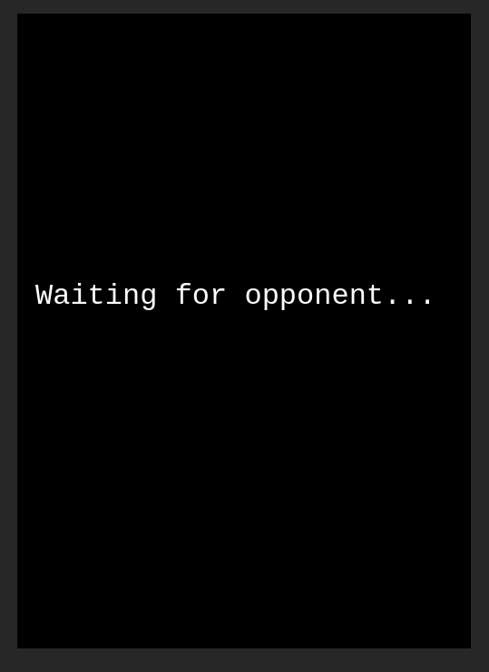
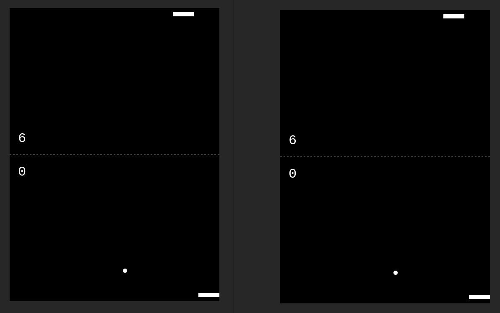
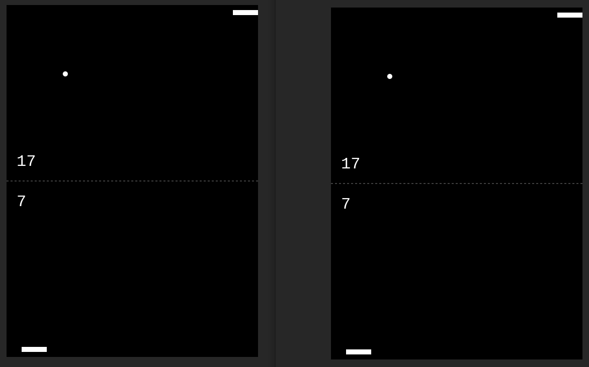

# 🏓 Multiplayer Pong

A real-time multiplayer version of the classic Pong game, built using **JavaScript**, **Socket.io**, and **Express** for seamless online gameplay.

## 📋 Table of Contents

- [Introduction](#introduction)
- [Features](#features)
- [Installation](#installation)
- [Usage](#usage)
- [Technologies](#technologies)
- [Configuration](#configuration)
- [Examples](#examples)
- [Contributing](#contributing)
- [Author](#author)
- [License](#license)

## 🎮 Introduction

**Multiplayer Pong** is an online version of the classic Pong game where two players can connect, compete, and play in real-time. Using **Socket.io**, the game synchronizes actions between both players, offering an interactive multiplayer experience.

## ✨ Features

- ⚡ Real-time multiplayer functionality.
- 🏎️ Smooth, responsive gameplay.
- 🖥️ Simple and clean UI using HTML/CSS.
- 🚀 Built with Node.js, Express, and Socket.io for real-time communication.

## ⚙️ Installation

### Prerequisites
- **Node.js** and **npm** installed on your machine.

### Setup
1. Clone the repository:
    ```bash
    git clone https://github.com/makhalifa/multiplayer-pong.git
    cd multiplayer-pong
    ```
2. Install dependencies:
    ```bash
    npm install
    ```

3. Start the server:
    ```bash
    npm start
    ```

4. Open your browser and navigate to:
    ```
    http://localhost:4000
    ```

## 🚀 Usage

- Run the server and share the `localhost` URL (or deploy the game) to play with friends.
- Two players can control their paddles using the keyboard (usually the arrow keys or WASD keys) in a browser window.
- The game starts automatically when both players join.

## 🛠️ Technologies

- **Node.js**: Backend server
- **Express**: Web framework
- **Socket.io**: Real-time communication
- **HTML/CSS**: Frontend interface
- **JavaScript**: Game logic

## 🔧 Configuration

You can modify the server port or game settings by editing the `server.js` and `sockets.js` files. Ensure to restart the server after any changes.

## 🖼️ Examples
Here are some screenshots of the gameplay:

  
  


You can view the live gameplay demo or explore the source code to customize and enhance it.

## 🤝 Contributing

Contributions are welcome! If you'd like to contribute, please:
- Fork the repository.
- Create a new branch for your feature.
- Submit a pull request.

Feel free to open issues for any bugs or feature requests.

## 👤 Author

- **Mohamed Khalifa**  
  [GitHub](https://github.com/makhalifa) | [LinkedIn](your-linkedin-profile)


## 📄 License

This project is licensed under the MIT License. See the [LICENSE](LICENSE.txt) file for details.